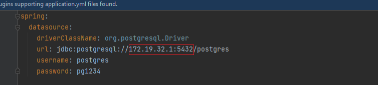

# invoice-accounting-project

<!-- PROJECT LOGO -->
<br />
<div align="left">
<a href="https://github.com/serkanbodur/invoice-accounting">
    
</a>

<h3 align="center">Invoice Accounting Application</h3>

<!-- TABLE OF CONTENTS -->
<details>
  <summary>Table of Contents</summary>
  <ol>
    <li>
      <a href="#about-the-project">About The Project</a>
    </li>
    <li>
      <a href="#project-include">Project Include</a>
      <ul>
        <li><a href="#built-with">Built With</a></li>
      </ul>
    </li>
    <li>
      <a href="#getting-started">Getting Started</a>
      <ul>
        <li><a href="#project-installation">Project Installation</a></li>
      </ul>
      <ul>
        <li><a href="#docker-installation">Docker Installation</a></li>
      </ul>
    </li>
    <li><a href="#usage">Usage</a></li>
    <li><a href="#roadmap">Roadmap</a></li>
    <li><a href="#contributing">Contributing</a></li>
    <li><a href="#license">License</a></li>
    <li><a href="#contact">Contact</a></li>

  </ol>
</details>


<!-- ABOUT THE PROJECT -->

## About The Project

In this project, the invoices of a purchasing specialist for the purchased products were recorded in the accounting
system.

Project Description:

* The new invoice information to be entered into the accounting system is not approved if the sum of all approved
  invoices entered by that purchasing specialist so far exceeds the specified limit, and approved if it does not exceed
  the limit.
* The limit is the same for all purchasing professionals during the process period.
* Each purchasing specialist is uniquely identified by the trio of Name, Surname and E-mail.
* Transactions of people with the same name and surname but different email addresses are evaluated separately.

<!-- PROJECT INCLUDE -->

## Project Include

1. Java Spring is used for project application.
2. The tests were written using JUnit
3. Project containerized with Docker
4. Requests can be sent to project endpoints with Postman or Swagger.

### Built With

* [Java](https://www.java.com/tr/)
* [Spring](https://spring.io/)
* [Docker](https://www.docker.com/)
* [Postgre](https://www.postgresql.org/)

<p align="right">(<a href="#top">back to top</a>)</p>

<!-- GETTING STARTED -->

## Getting Started

### Project Installation

Clone the repo

   ```sh
   git clone https://github.com/serkanbodur/invoice-accounting
   ```

### Docker Installation

1. Give the ip address to the spring:datasource:url path in the application.yml file.

<a href="https://github.com/serkanbodur/invoice-accounting">
    
</a>

<a href="https://github.com/serkanbodur/invoice-accounting">
    
</a>

2. Build the project and get it ready to work.

   ```sh
   mvn clean package
   ```

3. Create a file named Dockerfile in the directory where the project is located.
In this file, within the Docker image, the dependencies that the project should run and the steps such as port adjustments are defined.

   ```sh
   ##Project Dockerfile
   
   FROM openjdk:11
   ARG JAR_FILE=target/invoice-accounting-0.0.1-SNAPSHOT.jar
   COPY ${JAR_FILE} application.jar
   EXPOSE 8080

   ENTRYPOINT ["java", "-jar", "application.jar"]
   ```
4. Download the necessary files and name the image file 
so that the Docker image is created according to the created dockerfile

   ```sh
    docker build -t invoiceaccountingapp -f Dockerfile . 
   ```
   
5. Check if the docker image is created when the process is complete
   ```sh
    docker images -a 
   ```
<a href="https://github.com/serkanbodur/invoice-accounting">
    
</a>

6. Run the Docker image by giving the port number we want it to run
   ```sh
      docker run -p 8080:8080 invoiceaccountingapp 
   ```


