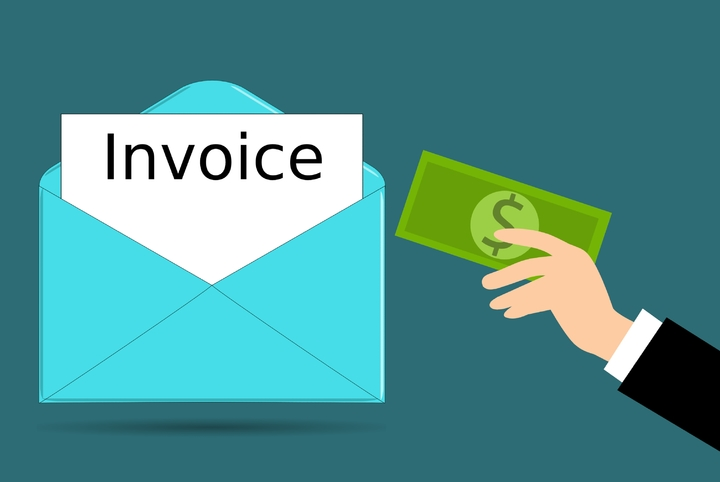
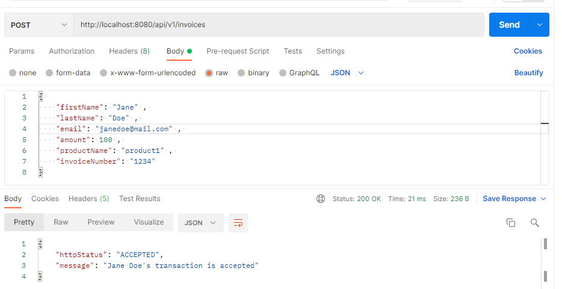
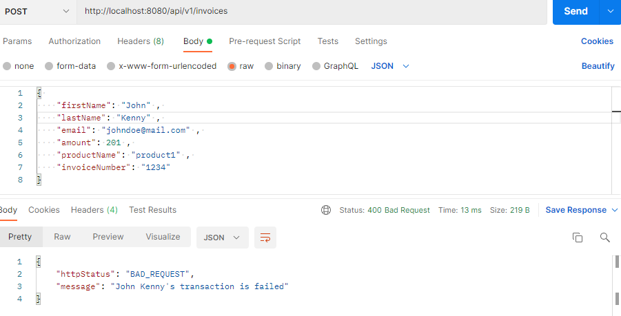
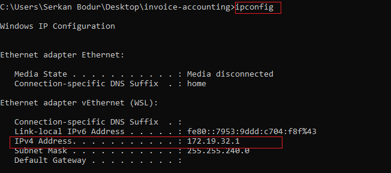
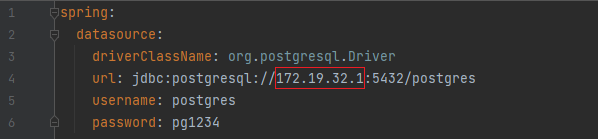
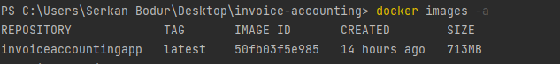

# invoice-accounting-project

<!-- PROJECT LOGO -->
<br />
<div align="left">
<a href="https://github.com/serkanbodur/invoice-accounting">
    
</a>

<h3 align="center">Invoice Accounting Application</h3>

<!-- TABLE OF CONTENTS -->
<details>
  <summary>Table of Contents</summary>
  <ol>
    <li>
      <a href="#about-the-project">About The Project</a>
    </li>
    <li>
      <a href="#project-include">Project Include</a>
        <ul><li><a href="#project-documents">Project Documents</a></li></ul>
      <ul>
        <li><a href="#project-screens">Project Screenshoots</a></li>
        <li><a href="#built-with">Built With</a></li>
      </ul>
    </li>
    <li>
      <a href="#getting-started">Getting Started</a>
      <ul>
        <li><a href="#project-installation">Project Installation</a></li>
      </ul>
      <ul>
        <li><a href="#docker-installation">Docker Installation</a></li>
      </ul>
    </li>
    <li><a href="#usage">Usage</a></li>
    <li><a href="#contributing">Contributing</a></li>
    <li><a href="#contact">Contact</a></li>

  </ol>
</details>


<!-- ABOUT THE PROJECT -->

## About The Project

In this project, the invoices of a purchasing specialist for the purchased products were recorded in the accounting
system.

Project Description:

* The new invoice information to be entered into the accounting system is not approved if the sum of all approved
  invoices entered by that purchasing specialist so far exceeds the specified limit, and approved if it does not exceed
  the limit.
* The limit is the same for all purchasing professionals during the process period.
* Each purchasing specialist is uniquely identified by the trio of Name, Surname and E-mail.
* Transactions of people with the same name and surname but different email addresses are evaluated separately.
* If a user with a different name or surname wants to perform an action with a previously registered email,
  this action will fail and the http status will become fail.

## Project Screen Shoots

<p align="center">Accepted Invoice</p>
<p align="center">

</p>
<br>

<p align="center">Rejected Invoice</p>
<p align="center">

</p>
<br>

<p align="center">Failed Invoice</p>
<p align="center">

</p>
<br>

<p align="center">All Accepted Invoice</p>
<p align="center">

</p>
<br>

<p align="center">All Rejected Invoices</p>
<p align="center">

</p>

<!-- PROJECT INCLUDE -->

## Project Include

1. Java Spring is used for project application.
2. The tests were written using JUnit
3. Project containerized with Docker
4. Requests can be sent to project endpoints with Postman or Swagger.
5. You can find Postman Collection and Curl Commands in this project 

## Project Documents
* [Postman-Collection](https://github.com/serkanbodur/invoice-accounting/blob/master/postman-collection/postman_collection.json)
* [Curl-Commands](https://github.com/serkanbodur/invoice-accounting/blob/master/curl-commands/curl-commands.txt)
* [Project-Story](https://github.com/serkanbodur/invoice-accounting/blob/master/project-story/Challenge-3[56].pdf)


### Built With

* [Java](https://www.java.com/tr/)
* [Spring](https://spring.io/)
* [Docker](https://www.docker.com/)
* [Postgre](https://www.postgresql.org/)

<p align="right">(<a href="#top">back to top</a>)</p>

<!-- GETTING STARTED -->

## Getting Started

### Project Installation

Clone the repo

   ```sh
   git clone https://github.com/serkanbodur/invoice-accounting
   ```

### Docker Installation

1. Give the ip address to the spring:datasource:url path in the application.yml file.

<a href="https://github.com/serkanbodur/invoice-accounting">
    
</a>

<a href="https://github.com/serkanbodur/invoice-accounting">
    
</a>

2. Build the project and get it ready to work.

   ```sh
   mvn clean package
   ```

3. Create a file named Dockerfile in the directory where the project is located.
In this file, within the Docker image, the dependencies that the project should run and the steps such as port adjustments are defined.

   ```sh
   ##Project Dockerfile
   
   FROM openjdk:11
   ARG JAR_FILE=target/invoice-accounting-0.0.1-SNAPSHOT.jar
   COPY ${JAR_FILE} application.jar
   EXPOSE 8080

   ENTRYPOINT ["java", "-jar", "application.jar"]
   ```
4. Download the necessary files and name the image file 
so that the Docker image is created according to the created dockerfile

   ```sh
    docker build -t invoiceaccountingapp -f Dockerfile . 
   ```
   
5. Check if the docker image is created when the process is complete
   ```sh
    docker images -a 
   ```
<a href="https://github.com/serkanbodur/invoice-accounting">
    
</a>
<br>

6. Run the Docker image by giving the port number we want it to run
   ```sh
      docker run -p 8080:8080 invoiceaccountingapp 
   ```
<!-- USAGE EXAMPLES -->
## Usage

- Run project once to create the tables and ddl operations
- Apply the operations according to appropriate endpoints using Postman or Swagger.

[Invoice Paths](https://github.com/serkanbodur/invoice-accounting/blob/master/src/main/java/com/example/invoiceaccounting/controller/InvoiceController.java)

| Request Method | Route                     | Request Body                                                                                                                                   | Description               |
|----------------|---------------------------|------------------------------------------------------------------------------------------------------------------------------------------------|---------------------------|
| POST           | /api/v1/invoices          | {  "firstName": "firstName" , "lastName": "lastName" , "email": "email" , "amount": 100 , "productName": "product1" , "invoiceNumber": "1234"} | Save an invoice           |
| GET            | /api/v1/invoices/approved | {  }                                                                                                                                           | Get all approved invoices |
| GET            | /api/v1/invoices/rejected | {  }                                                                                                                                           | Get all rejected invoices |

<!-- CONTRIBUTING -->
## Contributing

Contributions are what make the open source community such an amazing place to learn, inspire, and create. Any contributions you make are **greatly appreciated**.

If you have a suggestion that would make this better, please fork the repo and create a pull request. You can also simply open an issue with the tag "enhancement".
Don't forget to give the project a star! Thanks again!

1. Fork the Project
2. Create your Feature Branch (`git checkout -b feature/AmazingFeature`)
3. Commit your Changes (`git commit -m 'Add some AmazingFeature'`)
4. Push to the Branch (`git push origin feature/AmazingFeature`)
5. Open a Pull Request

<p align="right">(<a href="#top">back to top</a>)</p>


<!-- CONTACT -->
## Contact

Serkan Bodur

* [sbodur25@gmail.com](sbodur25@gmail.com)
* [Linkedln](https://tr.linkedin.com/in/serkan-bodur)


Project Link: [https://github.com/serkanbodur/invoice-accounting]

<p align="right">(<a href="#top">back to top</a>)</p>


